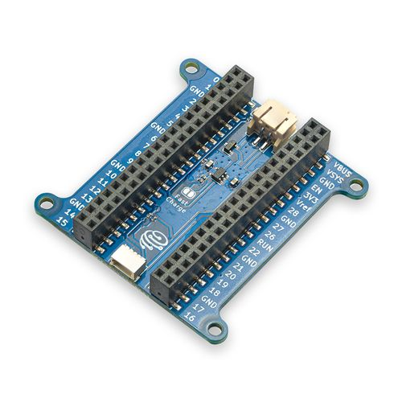

# PiicoDev® Expansion Board for Raspberry Pi Pico

The [PiicoDev® Expansion Board for Raspberry Pi Pico](https://core-electronics.com.au/catalog/product/view/sku/CE07693) is a great way to start experimenting with Raspberry Pi Pico/RP2040. Thanks to the onboard PiicoDev connector, you can quickly and easily connect to the PiicoDev family of sensor modules without soldering.

- Breaks out each Pico pin, with handy labels
- Take your project on the go with on-board LiPo battery charging.
- PiicoDev connector, compatible with Qwiic and STEMMA QT (3.3V only)
- Manufactured and [supported](https://core-electronics.com.au/contacts/) in Australia by Core Electronics

**Technical Details**

- Dimensions: 51x51mm
- M2.5 mounting holes
- Charge current: approx 220mA / 440mA (when Fast Charge jumper is soldered)
- PiicoDev connector: I2C0 (SCL:Pin 9, SDA:Pin 8)
- PiicoDev connector pinout:
  - 1 GND
  - 2 3.3V
  - 3 SDA
  - 4 SCL

# License
This project is open source - please review the LICENSE.md file for further licensing information.

If you have any technical questions, or concerns about licensing, please contact technical support on the [Core Electronics forums](https://forum.core-electronics.com.au/).

---
*\"PiicoDev" is a registered trademark of Core Electronics Pty Ltd*
